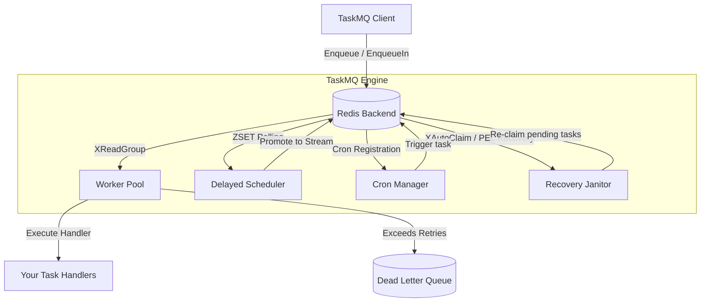

# TaskMQ

TaskMQ is a high-performance, distributed, Redis-backed asynchronous task queue and worker pool engine built in Go.

It uses **Redis Streams** as the underlying transport layer to provide reliable, distributed queueing with **At-Least-Once** delivery guarantees, automatic retries, and dead letter queueing.

---

## 🚀 Key Features

* **Distributed Worker Pool**: Powered by Redis Streams (`XReadGroup`, `XACK`, `XAutoClaim`), allowing multiple worker instances to process tasks concurrently and coordinate automatically.
* **At-Least-Once Delivery**: Built-in recovery loops automatically reclaim abandoned tasks (PEL recovery) if a worker crashes mid-task, ensuring no messages are lost.
* **Delayed / Scheduled Tasks**: Support for enqueuing tasks to be run at a specific time or after a delay, backed by a Redis sorted set (`ZSET`) scheduler.
* **Distributed Cron Manager**: Register cron jobs dynamically with spec parsing (`* * * * *`) and high-availability distributed locks to ensure each execution fires exactly once.
* **GCRA Rate Limiting**: Intelligent sliding-window rate limiting using the GCRA (Generic Cell Rate Algorithm) via Redis Lua scripts, supporting both single-queue and tenant-level (group key) rate limits.
* **Dead Letter Queue (DLQ)**: Automatically isolates failed tasks that exceed their retry limit, with APIs to list, retry, or delete dead letters.
* **Dependency Injection**: Seamless integration with the Go ecosystem using **Uber Fx**.

---

## 🛠️ Tech Stack

* **Language**: Go 1.23+
* **Queue Backend**: Redis (via `go-redis/v9`)
* **API Framework**: Echo v5 (HTTP) & gRPC (Protobuf APIs)
* **Dependency Injection**: Uber Fx
* **Logging**: Zap
* **Configuration**: Viper

---

## 📐 Architecture



---

## 🚦 Getting Started

### Prerequisites

* Go 1.23 or higher
* Redis 7.0+ (with Streams and ZSET support)

### Installation

```bash
git clone git@github.com:twn39/taskmq.git
cd taskmq
go mod tidy
```

### Running the Server

Start the Echo HTTP and gRPC management server:
```bash
go run cmd/server/main.go
```
The server will start on the port configured in `config.yaml` (default `:8080`).

### 🖥️ Web Admin Dashboard

TaskMQ features a built-in, fully responsive, slate-dark themed Web Admin Dashboard at `/admin`.

* **Live Monitoring**: Inspect queue consumption status (Active vs. Paused) and trace live metrics (Active Streams, Scheduled ZSET tasks, and Dead-letter counts).
* **Remediation**: Examine the details, payload, and stack trace of tasks in the Dead Letter Queue, with buttons to re-enqueue them for retry or purge them permanently.
* **Testing Console**: Trigger dummy tasks with customizable payloads, execution delays, or mock failures directly from the web console.

To access the panel, open your browser and navigate to `http://localhost:8080/admin`.

### 💻 Command Line Interface (CLI)

TaskMQ comes with a unified command-line management tool built using `urfave/cli/v3` to monitor and remediate queues directly from your terminal.

#### Global Connection Options
- `--redis-addr` (env override: `TASKMQ_REDIS_ADDR`): Redis address (default: `localhost:6379`).

#### Command Usage
* **View Queue Statistics**:
  ```bash
  go run cmd/taskmq-cli/main.go stats
  ```
* **Pause / Resume Queue**:
  ```bash
  go run cmd/taskmq-cli/main.go pause <queue_name>
  go run cmd/taskmq-cli/main.go resume <queue_name>
  ```
* **Manage DLQ (Dead Letter Queue)**:
  * List failed tasks (supports optional `--limit` count):
    ```bash
    go run cmd/taskmq-cli/main.go dlq list <queue_name> --limit 10
    ```
  * Re-enqueue a failed task for retry:
    ```bash
    go run cmd/taskmq-cli/main.go dlq retry <queue_name> <task_id>
    ```
  * Purge a failed task permanently:
    ```bash
    go run cmd/taskmq-cli/main.go dlq delete <queue_name> <task_id>
    ```

---

## 💻 Usage Example

### 1. Defining and Registering a Handler

```go
package main

import (
	"context"
	"fmt"
	"log"
	
	"github.com/redis/go-redis/v9"
	"github.com/twn39/taskmq/internal/taskmq"
	"go.uber.org/zap"
)

func main() {
	rdb := redis.NewClient(&redis.Options{Addr: "localhost:6379"})
	logger, _ := zap.NewProduction()

	// Initialize worker options with defaults
	opts := taskmq.NewDefaultWorkerOptions(rdb, logger, "email-queue", taskmq.JSONCodec{}, taskmq.WorkerOptions{
		Concurrency: 10,
	})

	// Create worker pool
	pool := taskmq.NewWorkerPool(rdb, logger, "email-queue", opts)

	// Register task handler
	pool.Register("send_welcome_email", func(ctx context.Context, task *taskmq.Task) error {
		fmt.Printf("Processing email for payload: %s\n", string(task.Payload))
		return nil
	})

	// Start processing tasks
	if err := pool.Start(context.Background()); err != nil {
		log.Fatalf("failed to start worker pool: %v", err)
	}
}
```

### 2. Enqueuing Tasks

```go
package main

import (
	"context"
	"time"

	"github.com/redis/go-redis/v9"
	"github.com/twn39/taskmq/internal/taskmq"
)

func main() {
	rdb := redis.NewClient(&redis.Options{Addr: "localhost:6379"})
	client := taskmq.NewClient(rdb)

	ctx := context.Background()

	// 1. Immediate Task
	task1 := taskmq.NewTask("send_welcome_email", []byte(`{"user_id": 123}`))
	_ = client.Enqueue(ctx, task1)

	// 2. Delayed Task (runs in 5 minutes)
	task2 := taskmq.NewTask("send_welcome_email", []byte(`{"user_id": 456}`))
	_ = client.EnqueueIn(ctx, task2, 5*time.Minute)

	// 3. Unique Task (prevents duplicate execution within a 1-hour window)
	task3 := taskmq.NewTask("send_welcome_email", []byte(`{"user_id": 789}`), taskmq.TaskOptions{
		UniqueKey: "welcome_email_user_789",
		UniqueTTL: 1 * time.Hour,
	})
	_ = client.Enqueue(ctx, task3)
}
```

---

## ⚙️ Configuration

Configuration is managed via `config.yaml` or environment variables starting with `TASKMQ_`.

Example configuration file:
```yaml
server:
  port: ":8080"
logger:
  level: "info"
redis:
  addr: "localhost:6379"
taskmq:
  queues:
    - name: "default"
      concurrency: 5
    - name: "high-priority"
      concurrency: 10
  cron_healing_interval: 1m
  janitor_interval: 3s
```

---

## 🧪 Testing

Run all unit and integration test suites:
```bash
# Run all tests
go test ./...

# Run integration tests specifically
go test ./tests/integration/... -v
```
