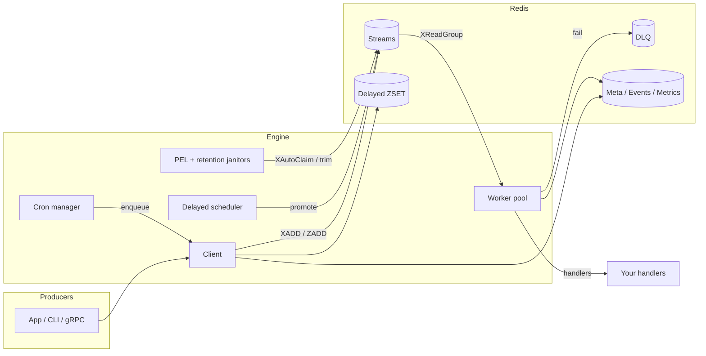

# TaskMQ

[](https://github.com/twn39/taskmq/actions/workflows/ci.yml)
[](https://go.dev/)
[](https://redis.io/docs/latest/develop/data-types/streams/)

**Redis Streams–backed distributed task queue for Go** — at-least-once delivery, delayed/cron jobs, GCRA rate limits, DLQ, and production-ready ops (HTTP · gRPC · CLI).

```text
Producer ──► Client.Enqueue* ──► Redis Streams / ZSET
                                      │
Workers ◄── XReadGroup · middleware · settle ──► Complete / Retry / DLQ
   ▲
   └── PEL reclaim · delayed promote · cron heal · retention
```

---

## Why TaskMQ

| | |
|---|---|
| **Reliable** | Consumer groups + PEL reclaim; unsettled broker errors stay pending for retry |
| **Operable** | Pause/cancel/inspect via **gRPC**, **HTTP admin**, and **CLI** |
| **Observable** | Task meta, events stream, worker heartbeats, Prometheus scrape endpoints |
| **Cluster-ready** | Hash-tagged keys (`taskmq:{queue}:…`); standalone / cluster / sentinel |
| **Composable** | Uber Fx module, ISP client ports, functional worker options |

Feature map vs Asynq / BullMQ → [docs/COMPARISON.md](docs/COMPARISON.md)

---

## Features

### Core queue

- **Worker pools** on Redis Streams (`XReadGroup` / `XACK` / `XAutoClaim`)
- **At-least-once** delivery with PEL recovery janitor
- **Delayed & scheduled** tasks (ZSET + scheduler)
- **Distributed cron** with healing locks
- **GCRA rate limiting** (queue- and group-key scoped)
- **Dead letter queue** — list / retry / delete
- **Unique tasks** with TTL + scope (`UntilSucceeded` / `UntilStart` / `UntilSuccess`)
- **SkipRetry / Unrecoverable** permanent failures; timeout + absolute deadline
- **Bulk enqueue** (pipeline) for producers

### Ops & observability

- Per-task **meta** inspect (`GetTaskInfo`, HTTP, CLI, gRPC)
- Optional **completed retention** + handler results
- **Queue events** stream (`enqueued`, `active`, `completed`, `failed`, `stalled`, …)
- **Worker heartbeats** for live consumer inventory
- **Progress** reporting (meta + events)
- **Lifecycle admission** (soft/hard stream limits, delayed caps, payload limits)
- **Metrics**: process-local + Redis HASH depths; Prometheus text formats

### Platform

- **Uber Fx** DI module for server + workers
- **Echo** admin dashboard · **gRPC** multi-language API · **CLI** ops tool
- **Binary / JSON** codecs; Viper config + `TASKMQ_*` env overrides

---

## Architecture



**Settlement rules** (handlers never XACK): [docs/TERMINAL_OUTCOMES.md](docs/TERMINAL_OUTCOMES.md)

---

## Quick start

### Prerequisites

- **Go** 1.23+
- **Redis** 7+ (Streams + ZSET)

### Install & run server

```bash
git clone git@github.com:twn39/taskmq.git
cd taskmq
go mod tidy

# Redis on localhost:6379, then:
go run ./cmd/server
```

| Endpoint | Default |
|---|---|
| HTTP + admin | `http://localhost:8080` · dashboard `/admin` |
| gRPC | `:50051` (see `config.yaml`) |

Config: [`config.yaml`](config.yaml) · production template: [`config.prod.yaml`](config.prod.yaml)  
Env prefix: `TASKMQ_` (e.g. `TASKMQ_SERVER_PORT=:3000`, `TASKMQ_REDIS_ADDR=…`)

### Minimal producer

```go
package main

import (
	"context"
	"time"

	"github.com/redis/go-redis/v9"
	"github.com/twn39/taskmq/internal/taskmq/client"
	"github.com/twn39/taskmq/internal/taskmq/task"
)

func main() {
	rdb := redis.NewClient(&redis.Options{Addr: "localhost:6379"})
	c := client.NewClient(rdb)
	ctx := context.Background()

	// Immediate
	_ = c.Enqueue(ctx, task.NewTask("send_welcome_email", []byte(`{"user_id":123}`),
		task.TaskOptions{Queue: "email-queue"}))

	// Delayed
	_ = c.EnqueueIn(ctx, task.NewTask("send_welcome_email", []byte(`{"user_id":456}`),
		task.TaskOptions{Queue: "email-queue"}), 5*time.Minute)

	// Unique (dedup while lock held)
	_ = c.Enqueue(ctx, task.NewTask("send_welcome_email", []byte(`{"user_id":789}`),
		task.TaskOptions{
			Queue:     "email-queue",
			UniqueKey: "welcome_email_user_789",
			UniqueTTL: time.Hour,
		}))
}
```

### Minimal worker

```go
package main

import (
	"context"
	"fmt"
	"log"

	"github.com/redis/go-redis/v9"
	"github.com/twn39/taskmq/internal/taskmq/codec"
	"github.com/twn39/taskmq/internal/taskmq/task"
	"github.com/twn39/taskmq/internal/taskmq/worker"
	"go.uber.org/zap"
)

func main() {
	rdb := redis.NewClient(&redis.Options{Addr: "localhost:6379"})
	logger := zap.NewExample()

	pool := worker.NewWorkerPool(rdb, logger, "email-queue",
		worker.WithConcurrency(10),
		worker.WithCodec(codec.JSONCodec{}),
	)

	pool.Register("send_welcome_email", func(ctx context.Context, t *task.Task) error {
		fmt.Printf("payload: %s\n", t.Payload)
		return nil
	})

	if err := pool.Start(context.Background()); err != nil {
		log.Fatal(err)
	}
	select {} // block; use Fx lifecycle in production
}
```

> **Production:** share one `*lifecycle.Lifecycle` between client and workers (`taskmq.Module` / `BuildWorkerTopologyWithLifecycle`). See [docs/OPERATIONS.md](docs/OPERATIONS.md).

---

## API surfaces

| Capability | gRPC | HTTP admin | CLI |
|---|:---:|:---:|:---:|
| Enqueue / delayed / bulk | ✅ | ✅ | — |
| Cron register | ✅ | ✅ | — |
| DLQ list / retry / delete | ✅ | ✅ | ✅ |
| Pause / resume | ✅ | ✅ | ✅ |
| Cancel / get task | ✅ | ✅ | ✅ |
| Scheduled / active list | ✅ | ✅ | ✅ |
| Events / workers / metrics | — | ✅ | ✅ |
| Dashboard | — | ✅ `/admin` | — |

Full matrix → [docs/OPERATIONS.md](docs/OPERATIONS.md#api-surfaces-grpc-vs-http-vs-cli)

---

## CLI

```bash
# Build once (optional)
go build -o bin/taskmq-cli ./cmd/taskmq-cli

export REDIS_ADDR=localhost:6379   # or --redis-addr

go run ./cmd/taskmq-cli stats
go run ./cmd/taskmq-cli pause <queue>
go run ./cmd/taskmq-cli resume <queue>

go run ./cmd/taskmq-cli dlq list <queue> [limit]
go run ./cmd/taskmq-cli dlq retry <queue> <task_id>
go run ./cmd/taskmq-cli dlq delete <queue> <task_id>

go run ./cmd/taskmq-cli task get <queue> <task_id>
go run ./cmd/taskmq-cli task cancel <queue> <task_id>
go run ./cmd/taskmq-cli task scheduled <queue> [limit]
go run ./cmd/taskmq-cli task active <queue> [limit]

go run ./cmd/taskmq-cli events <queue> [limit]
go run ./cmd/taskmq-cli workers <queue>
go run ./cmd/taskmq-cli metrics [queue]
```

---

## Admin dashboard

Open **[http://localhost:8080/admin](http://localhost:8080/admin)** after starting the server.

- Live queue depth (stream / delayed / DLQ) and pause state  
- DLQ inspect, retry, purge  
- Test console for ad-hoc enqueue  

---

## Configuration

Managed by Viper: `config.yaml` (or `config.$APP_ENV.yaml`) + `TASKMQ_*` env vars.

```yaml
server:
  port: ":8080"
  grpc_port: ":50051"
logger:
  level: "info"
redis:
  mode: standalone          # standalone | cluster | sentinel
  addr: "localhost:6379"
taskmq:
  codec: binary
  shutdown_timeout: 30s
  # events_max_len: 10000   # queue events stream MAXLEN (0 = default)
  # completed_retention: 24h
  lifecycle:
    delayed_overflow: reject
    dlq_max_count: 1000
    cancelled_ttl: 24h
    safe_trim_enabled: true
  queues:
    - name: default
      concurrency: 5
```

More: [docs/OPERATIONS.md](docs/OPERATIONS.md) · Lua scripts: [docs/LUA_SCRIPTS.md](docs/LUA_SCRIPTS.md)

---

## Development

### Common commands

| Task | Command |
|---|---|
| Build | `go build ./...` · `make build` |
| Unit tests | `go test ./internal/... -count=1` · `make test-unit` |
| Race | `go test ./internal/... -race -count=1` · `make test-race` |
| Integration (needs Redis) | `go test ./tests/integration/... -count=1` · `make test-integration` |
| Key schema guard | `./scripts/check_keys_schema.sh` · `make keys` |
| Coverage gates | `make cover-gate` · `make cover` |
| Regenerate protobuf | `make proto` |
| Lint | `golangci-lint run` · `make lint` |

Coverage floors: [`coverage.yaml`](coverage.yaml)

### CI

[`.github/workflows/ci.yml`](.github/workflows/ci.yml) runs on every push/PR:

| Job | Scope |
|---|---|
| Build & unit | tidy, build, key schema, unit + race, **coverage gates**, artifacts |
| Lint | `golangci-lint` |
| Integration | full suite vs Redis 7 service |
| Nightly | integration-race + optional cluster smoke |

---

## Documentation

| Doc | Contents |
|---|---|
| [docs/OPERATIONS.md](docs/OPERATIONS.md) | Deploy, lifecycle limits, metrics scrape, API surfaces, events |
| [docs/TERMINAL_OUTCOMES.md](docs/TERMINAL_OUTCOMES.md) | Settlement matrix, `SkipRetry` vs `Handled`, test map |
| [docs/LUA_SCRIPTS.md](docs/LUA_SCRIPTS.md) | Script ownership & hash-tag contracts |
| [docs/COMPARISON.md](docs/COMPARISON.md) | TaskMQ vs Asynq vs BullMQ |
| [AGENTS.md](AGENTS.md) | Contributor / AI agent guidelines |
| [`.codegraph/README.md`](.codegraph/README.md) | Codebase knowledge graph |

---

## Project layout

```text
cmd/server          HTTP + gRPC process
cmd/taskmq-cli      Ops CLI
api/proto/taskmq/v1 Protobuf + generated stubs
internal/taskmq/    Engine (client, worker, broker, lifecycle, …)
internal/handler    HTTP admin handlers
tests/integration   Redis-backed end-to-end suites
docs/               Operations & design notes
```

---

## Design notes

- **Handlers** return `error` / `task.SkipRetry` / `task.Unrecoverable` only — never settle the stream message.  
- **Middleware** returns `worker.Handled` / `Abort` after broker settlement.  
- **Multi-key Lua** stays under the same `{queue}` hash tag for Cluster.  
- **Observability** (meta / events / metrics) is best-effort and must not block settlement.

